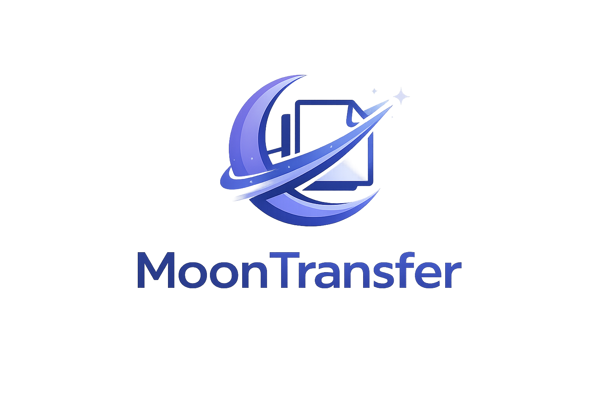

# MoonTransfer

<p align="center">
  
</p>

Italian version: [README.it.md](README.it.md)

MoonTransfer is a GUI for sending and receiving files and folders through
[`croc`](https://github.com/schollz/croc).

Its goal is to make file transfer simple: the sender chooses one or more files
and folders, MoonTransfer shows a code, and the receiver enters that code to
save the selected content.

MoonTransfer does not implement its own cryptographic protocol. Security,
connection handling, and transfer are provided by `croc`; MoonTransfer only
provides the graphical interface and includes the `croc` binary in the built
application.

## Current status

MoonTransfer is in an early stage. The main flow is already working:

- sending one or more files, folders, or a mixed selection;
- preserving nested and empty folders;
- receiving a bounded manifest through a code before accepting the main
  download;
- using `croc`'s native accept/reject prompt for the main transfer;
- showing `croc` output in the GUI;
- generating one user-facing code while keeping internal control codes hidden;
- showing selected roots, total size, and per-file SHA-256 information before
  downloading the main content;
- receiving into isolated staging, checking the exact manifest, and publishing
  the result only after verification;
- local build with PyInstaller;
- automatic download of the `croc` binary during the build;
- pinned `croc` version and SHA-256 verification for supported platforms;
- final bundle with `croc` included;
- an embedded build identity containing the full MoonTransfer version, source
  commit, bundled `croc` version, and MoonTransfer protocol version;
- automated testable `onedir` artifacts for Linux x86_64, Windows x86_64,
  macOS Intel, and macOS Apple Silicon.

The current public alpha, `v0.1.0-alpha.3`, is distributed from the
[GitHub Releases page](https://github.com/gaumeloth/MoonTransfer/releases) as
pre-built `onedir` archives. The builds are not signed or notarized and are
intended for early testing rather than production use. Native installers are
not available yet.

On Linux and Windows, the archive contains a portable `MoonTransfer` folder:
keep the entire folder, not just its executable. On macOS, it contains a
`MoonTransfer.app` application bundle, which must likewise be kept intact.

The window title shows the full build version. The information button in the
lower-right corner opens a copyable diagnostic summary containing the version,
commit, bundled `croc`, protocol, Python runtime, and platform. It deliberately
does not include transfer codes or local paths. Include this summary when
reporting a build-specific problem.

## Transport compatibility

> [!IMPORTANT]
> Builds produced from the current source bundle `croc 11.0.1`. They cannot
> transfer data to or from MoonTransfer builds based on `croc 10.x`. Update
> MoonTransfer on both devices before starting a transfer; using the same
> MoonTransfer release on both sides is the safest choice.

The compatibility boundary is:

| MoonTransfer build | Bundled `croc` | Compatible with the current source |
| --- | --- | --- |
| `v0.1.0-alpha.1` | `10.4.13` | No |
| `v0.1.0-alpha.2` | `10.7.0` | No |
| `v0.1.0-alpha.3` and current source | `11.0.1` | Yes |

The `alpha.1` and `alpha.2` archives remain useful only with other pre-`croc
11` builds. Use `alpha.3` or a newer build at both endpoints. This is a
transport-protocol incompatibility, not an operating-system incompatibility:
current desktop and Android builds remain compatible when they use `croc 11`
and the same MoonTransfer protocol version.

`croc 11` introduced version 2 of its PAKE wire protocol and deliberately
rejects peers using the earlier handshake. The new handshake explicitly binds
the key exchange to the two peers, their roles, the session, room and
transcript; it also strengthens key derivation and salt handling and adds
mutual key confirmation. Falling back silently would remove those protections,
so MoonTransfer does not attempt it. See the official [`croc 11.0.0` release
notes](https://github.com/schollz/croc/releases/tag/v11.0.0) and the upstream
[security upgrade](https://github.com/schollz/croc/pull/1212).

With a mixed old/new pair, the connection fails while securing the channel,
before MoonTransfer can exchange its metadata manifest or start the main
payload. No selected payload is downloaded or published. Depending on which
side reports the error, the technical details can mention an unsupported PAKE
protocol version and ask to upgrade both clients, or show the more general
`could not secure channel` message.

## Quick guide

To use the pre-built alpha, follow these steps in order:

1. open the [Releases page](https://github.com/gaumeloth/MoonTransfer/releases);
2. open the most recent alpha release;
3. download the archive matching your operating system and architecture;
4. extract the complete archive;
5. open the extracted folder and start MoonTransfer.

You do not need to install Python, `uv`, or `croc` when using a pre-built
archive.

## Download a pre-built alpha

Release files use names such as:

```text
MoonTransfer-0.1.0-alpha.3-linux-x86_64.tar.gz
MoonTransfer-0.1.0-alpha.3-windows-x86_64.zip
MoonTransfer-0.1.0-alpha.3-macos-x86_64.tar.gz
MoonTransfer-0.1.0-alpha.3-macos-arm64.tar.gz
```

The version number may be newer than the example. Download only files attached
to the official [MoonTransfer Releases
page](https://github.com/gaumeloth/MoonTransfer/releases).

Expand only the operating system you are using.

<details>
<summary>Linux</summary>

The published Linux archive currently supports x86_64 Intel/AMD systems. You
can check your architecture with:

```sh
uname -m
```

If the output is `x86_64`, download the file ending in
`linux-x86_64.tar.gz`. Extract it, open the resulting versioned folder, and
start the `MoonTransfer` file.

From a terminal inside the extracted folder, you can instead run:

```sh
./MoonTransfer
```

Linux ARM64 is supported by the build tools but is not currently published as
an automated release artifact. Build from source on that architecture.

</details>

<details>
<summary>Windows</summary>

The published Windows archive currently supports x86_64 Intel/AMD systems,
which includes most Windows 10 and Windows 11 computers.

1. Download the file ending in `windows-x86_64.zip`.
2. Right-click the ZIP file and choose **Extract All**.
3. Open the extracted versioned folder.
4. Double-click `MoonTransfer.exe`.

Do not run the executable directly from inside the ZIP and do not move it away
from the `_internal` folder.

The alpha is not code-signed, so Microsoft Defender SmartScreen may show an
unknown-publisher warning. Confirm that the archive came from the official
Releases page and verify its checksum before choosing **More info > Run
anyway**.

</details>

<details>
<summary>macOS</summary>

Download the archive matching the Mac processor:

- `macos-arm64.tar.gz` for Apple Silicon Macs with an M-series processor;
- `macos-x86_64.tar.gz` for Intel Macs.

Double-click the downloaded archive to extract it, open the resulting versioned
folder, and start `MoonTransfer.app`.

The alpha is not signed or notarized. On first start, Control-click
`MoonTransfer.app`, choose **Open**, and confirm. Depending on the macOS
version, it can also be allowed from **System Settings > Privacy & Security**.

</details>

Each alpha release also contains `SHA256SUMS`. It lists the expected SHA-256
digest of every downloadable archive and can be used to check that a download
is complete and unchanged.

## Download the source

Building from source remains useful for contributors, unsupported release
architectures, or anyone who wants to inspect the complete build process.

The project repository is:

```text
https://github.com/gaumeloth/MoonTransfer
```

You can download MoonTransfer in two ways:

- with Git, recommended if you want to update the repository easily or
  contribute;
- as a ZIP archive, simpler if you only want to try or build the program
  without using Git.

Expand only the method you want to use.

<details>
<summary>Download with Git</summary>

If you do not have Git, install it first from the
[official download page](https://git-scm.com/downloads/).

Operating-system-specific instructions are collapsed by default: expand only
the one for the system you are using.

<details>
<summary>Linux</summary>

On Linux, you can use your distribution package manager, for example:

```sh
sudo pacman -S git          # Arch Linux
sudo apt install git        # Debian, Ubuntu, and derivatives
sudo dnf install git        # Fedora
```

</details>

<details>
<summary>macOS</summary>

On macOS, you can install Apple's command line tools by running:

```sh
git --version
```

If Git is not present, macOS will offer to install the Command Line Tools.
Alternatively, you can use Homebrew:

```sh
brew install git
```

</details>

<details>
<summary>Windows</summary>

On Windows, download Git from the
[official Windows page](https://git-scm.com/download/win), start the installer,
and use these choices:

- download the regular installer for your architecture, usually **64-bit Git
  for Windows Setup** on Intel/AMD PCs;
- keep the default components;
- at the `PATH` step, select **Git from the command line and also from
  3rd-party software**, so `git` also works from PowerShell;
- for editor, line endings, terminal, HTTPS, and extra options, you can keep
  the defaults;
- Git Credential Manager can stay enabled; it is useful if you later work with
  private repositories.

</details>

After installation, close and reopen the terminal, then verify:

```sh
git --version
```

Download the repository:

```sh
git clone https://github.com/gaumeloth/MoonTransfer.git
cd MoonTransfer
```

From now on, run all following commands from inside the `MoonTransfer` folder.

</details>

<details>
<summary>Download as a ZIP archive</summary>

This method does not require Git.

1. Open the [project GitHub page](https://github.com/gaumeloth/MoonTransfer).
2. Press **Code**.
3. Choose **Download ZIP**.
4. Extract the archive into a folder.
5. Open the extracted folder.

The extracted folder may be named `MoonTransfer-main` instead of
`MoonTransfer`. That is fine: use that folder for the following commands.

Now open a terminal inside the extracted folder.

<details>
<summary>Linux/macOS</summary>

You can use the file manager and choose **Open in terminal**, or open a
terminal and manually move into the extracted folder with `cd`.

</details>

<details>
<summary>Windows</summary>

Open the extracted folder in File Explorer. Then use one of these methods:

- right-click an empty area of the folder and choose **Open in Terminal**;
- or click the path bar, type `powershell`, and press Enter.

</details>

GitHub also documents source archive downloads in its
[official documentation](https://docs.github.com/en/repositories/working-with-files/using-files/downloading-source-code-archives).

</details>

## Prepare the system

To create the build, you need:

- [`uv`](https://docs.astral.sh/uv/);
- Python 3.13.x or 3.14.x, installed manually or managed by `uv`;
- Internet access during the build;
- a platform supported by `tools/fetch_croc.py`: Linux x86_64/ARM64, macOS
  Intel/Apple Silicon, or Windows x64/ARM64.

The simplest approach is to install `uv` and let `uv` manage Python for the
project.

### Install uv

The official `uv` documentation is available at
[docs.astral.sh/uv](https://docs.astral.sh/uv/). Updated installation
instructions are on the
[Installing uv](https://docs.astral.sh/uv/getting-started/installation/) page.

Expand only the operating system you are using.

<details>
<summary>Arch Linux</summary>

```sh
sudo pacman -S uv
```

</details>

<details>
<summary>Linux/macOS</summary>

```sh
curl -LsSf https://astral.sh/uv/install.sh | sh
```

If the `uv` command is not found after installation, close and reopen the
terminal.

</details>

<details>
<summary>Windows PowerShell</summary>

```powershell
powershell -ExecutionPolicy ByPass -c "irm https://astral.sh/uv/install.ps1 | iex"
```

After installation, close and reopen PowerShell.

</details>

Verify the installation:

```sh
uv --version
```

### Prepare Python

MoonTransfer requires Python 3.13.x or 3.14.x. `uv` can use a version already
installed on the system or install a compatible one.

From the project folder, check which Python is found:

```sh
uv python find --show-version
```

If the command shows version `3.13.x` or `3.14.x`, you can continue.

If the command fails, or does not find a compatible version, run:

```sh
uv python install '>=3.13,<3.15'
```

Then try again:

```sh
uv python find --show-version
```

If you prefer to install Python manually, choose a stable Python 3.13 or 3.14
version from the
[official download page](https://www.python.org/downloads/).

<details>
<summary>Windows: install Python manually</summary>

On Windows, you have two practical options.

The first is the **Python install manager**, recommended by the recent official
documentation. Download it from the Python page, install it, open PowerShell,
and then install a compatible runtime:

```powershell
py install 3.14
```

Alternatively, you can install Python 3.13:

```powershell
py install 3.13
```

If the setup offers to add Python to `PATH`, accept it: this makes PowerShell
usage simpler.

The second option is the classic installer for a single Python release:

- on the Windows release page, choose **Windows installer (64-bit)** on modern
  Intel/AMD PCs, or **Windows installer (ARM64)** on Windows ARM;
- do not choose the **embeddable package**, because it is meant for embedding
  Python in other applications, not for terminal usage;
- on the first screen, enable **Add python.exe to PATH**;
- use **Install Now** for a standard installation, or **Customize
  installation** only if you want to review the options;
- if you use the custom screen, leave `pip`, `py launcher`, and the standard
  files enabled;
- if **Disable path length limit** appears at the end, you can enable it: it is
  not required for MoonTransfer, but it reduces possible long-path limits in
  other Python projects.

After installation, close and reopen PowerShell, then verify:

```powershell
python --version
py --version
```

One of the available versions must be Python 3.13.x or 3.14.x. If Windows opens
the Microsoft Store instead of Python, check **Manage app execution aliases**
and disable any Store Python aliases that interfere with the real installation.

</details>

## Create the build

The build installs Python dependencies, downloads the `croc` binary for the
current platform, and creates the PyInstaller package in `dist/`.

The `croc` version and expected SHA-256 hashes are declared in
`[tool.moontransfer.croc]` in `pyproject.toml`. A normal build uses that pinned
version; it does not automatically switch to the latest upstream `croc`
release.

Use the script for your operating system. The scripts check the main
prerequisites, run `uv sync --frozen --dev` using the committed `uv.lock`, and
then call `tools/build.py`.

<details>
<summary>Linux</summary>

From the project folder:

```sh
./scripts/build.sh
```

You can launch the command from fish, bash, or zsh as `./scripts/build.sh`.
Do not run it as `fish scripts/build.sh`.

If the build completes successfully, the program will be in:

```text
dist/MoonTransfer/
```

</details>

<details>
<summary>macOS</summary>

From the project folder:

```sh
./scripts/build.sh
```

You can launch the command from fish, bash, or zsh as `./scripts/build.sh`.
Do not run it as `fish scripts/build.sh`.

If the build completes successfully, the application bundle will be:

```text
dist/MoonTransfer.app
```

</details>

<details>
<summary>Windows</summary>

Open PowerShell in the project folder and run:

```powershell
powershell -ExecutionPolicy Bypass -File .\scripts\build.ps1
```

If the build completes successfully, the program will be in:

```text
dist\MoonTransfer\
```

</details>

<details>
<summary>Advanced method</summary>

The common command, valid on all systems after preparing the environment with
`uv sync --frozen --dev`, is:

```sh
uv run --frozen --dev python tools/build.py
```

`tools/build.py` is the build orchestrator: it runs `tools/fetch_croc.py` and
then PyInstaller using `MoonTransfer.spec`. Before packaging, it writes the
ignored `build/generated/build-info.json` file. A local build receives a
`0.1.0-dev.<commit>` identity; a clean checkout at an exact pre-release tag
receives that tag's version. Release automation passes the version and commit
explicitly so the archive name and the version shown by the application cannot
diverge.

The application icon has a single version-controlled PNG source. Qt loads that
PNG directly at runtime. On Windows and macOS, PyInstaller uses the Pillow
development dependency to convert it to the native application icon during the
build, so separate `.ico` and `.icns` sources do not need to be maintained.

To check the latest upstream `croc` release without changing the build pin:

```sh
uv run --frozen python tools/fetch_croc.py --latest
```

</details>

## Start MoonTransfer

After the build, use the output described for your operating system below. On
Linux and Windows, keep the entire generated folder together: the executable
must remain next to the files and folders generated by PyInstaller. On macOS,
keep the generated application bundle intact.

<details>
<summary>Linux</summary>

From the file manager, open `dist/MoonTransfer/` and start the `MoonTransfer`
file.

If the file manager does not start it with a double click, you can use the
terminal:

```sh
./dist/MoonTransfer/MoonTransfer
```

</details>

<details>
<summary>macOS</summary>

Open `dist/` in Finder and start:

```text
MoonTransfer.app
```

The application is not currently signed or notarized. If macOS blocks its first
start, Control-click `MoonTransfer.app`, choose **Open**, and confirm. Depending
on the macOS version, you can also allow it from **System Settings > Privacy &
Security**.

From the project folder, Finder can also be asked to open the application with:

```sh
open dist/MoonTransfer.app
```

</details>

<details>
<summary>Windows</summary>

Open:

```text
dist\MoonTransfer\
```

and double-click:

```text
MoonTransfer.exe
```

</details>

## Troubleshooting

### Qt SVG icon warnings on Linux

When MoonTransfer is started from a terminal, Qt may print warnings such as:

```text
qt.svg: Cannot read file '/usr/share/icons/BeautyLine/places/16/folder-new.svg',
because: Start tag expected. (line 1)
```

This means Qt tried to load an SVG icon from the current system icon theme, but
that icon file is not valid SVG. It usually points to a corrupted, empty,
truncated, or otherwise invalid icon file in the desktop theme. It does not
affect file transfers, `croc`, encryption, or the received file content. At
most, a file-dialog or folder icon may be missing or displayed incorrectly.

To check the icon file on the affected system:

```sh
file /usr/share/icons/BeautyLine/places/16/folder-new.svg
head -n 5 /usr/share/icons/BeautyLine/places/16/folder-new.svg
```

On Arch-based systems such as Garuda, you can also check which package owns the
file:

```sh
pacman -Qo /usr/share/icons/BeautyLine/places/16/folder-new.svg
```

The proper fix is to reinstall or update the icon theme package, choose another
icon theme, or repair the invalid SVG file.

## Use MoonTransfer

To complete a transfer, you need two people or two computers:

- the sender opens the **Invia** (Send) tab and generates a code;
- the receiver opens the **Ricevi** (Receive) tab and enters that code.

Both computers must be connected to the Internet. The code must be shared
outside MoonTransfer, for example via chat, phone, or email.

### Send files and folders

On the sending computer:

1. open MoonTransfer;
2. go to the **Invia** (Send) tab;
3. drag files and folders into the selection list, or use **Aggiungi file**
   (Add files) and **Aggiungi cartella** (Add folder);
4. review the list and use **Rimuovi** (Remove) or **Svuota** (Clear) if needed;
5. press **Invia** (Send);
6. wait while MoonTransfer scans the selection and calculates SHA-256 hashes;
7. share the displayed code with the receiver.

The code first lets the receiver download a bounded manifest containing the
selected paths, sizes, and per-file SHA-256 hashes. MoonTransfer then opens one
main `croc` transfer for the complete payload and waits for the receiver to
accept or reject it through `croc`'s native prompt.

During the main transfer, MoonTransfer shows overall progress, transferred size,
current speed, elapsed time, and estimated remaining time when `croc` provides
enough progress information.

MoonTransfer scans and fingerprints regular files in the background before
showing the code. It checks the selected tree again before starting the main
process. The **Stop** button can cancel preparation, verification, or an active
transfer.

The code is one-time use: it is valid for that transfer and should not be
reused.

### Receive files and folders

On the receiving computer:

1. open MoonTransfer;
2. go to the **Ricevi** (Receive) tab;
3. paste the received code;
4. choose the destination folder;
5. press **Ricevi** (Receive);
6. review the selected roots, file and folder counts, total size, and SHA-256
   information shown by MoonTransfer;
7. expand the manifest details if you need the path, size, and hash of each
   file;
8. accept or reject the transfer;
9. if a single file with the same name already exists, choose whether to skip,
   overwrite, or save the incoming file with another name;
10. if a folder or group conflicts with existing content, reject it or use the
    proposed unique folder name;
11. wait for the transfer to complete.

The main payload is downloaded only after MoonTransfer accepts `croc`'s main
transfer prompt. If you reject the transfer, MoonTransfer connects only to
refuse the main transfer and does not download its content. At the end,
MoonTransfer verifies the exact set of paths, entry types, sizes, and per-file
SHA-256 hashes before publishing anything in the final destination.

Destination comparison and final SHA-256 verification run in the background.
The **Stop** button remains available while these checks are in progress.

During the main transfer, MoonTransfer shows overall progress, downloaded size,
current speed, elapsed time, and estimated remaining time when `croc` provides
enough progress information.

A single received file or folder keeps its original root name. A selection
with multiple roots is stored in a `MoonTransfer` container folder. Existing
folders are never merged or recursively overwritten; MoonTransfer proposes a
unique name such as `MoonTransfer (1)` instead.

### Current payload limits

MoonTransfer currently accepts regular files and ordinary folders, including
empty folders. Symbolic links, junction-like entries, sockets, FIFOs, devices,
and other special filesystem objects are rejected rather than followed or
recreated.

A payload can contain at most 10,000 manifest entries and 256 selected roots.
The manifest is limited to 4 MiB. A folder and one of its descendants cannot be
selected as separate roots, and root names that would collide on a
case-insensitive or Unicode-normalizing filesystem are rejected.

If the transfer does not start, check that both computers are connected to the
Internet and that any firewall or corporate network is not blocking the
connections used by `croc`.

## For contributors

### Project status and roadmap

MoonTransfer is in active early development. It already provides a graphical
send/receive flow, bundles a pinned and checksum-verified `croc` binary during
builds, includes unit tests for the non-GUI logic, and publishes native
pre-built alpha archives for the main platforms. The current public line is
`v0.1.0-alpha.3`. Android is a functional but experimental single-file debug
target, not a supported end-user release.

Possible future improvements, in indicative order:

- collect feedback from `alpha.3` and continue validating the automated
  `onedir` artifacts on their target systems;
- continue hardening the Kivy Android target, especially lifecycle edge cases,
  device coverage, multi-item payloads, and release packaging, before treating
  Android as a supported platform;
- add signing and notarization where appropriate, then evaluate more native
  distribution formats such as AppImage, a Windows installer, and a macOS disk
  image;
- let the sender choose the container name for multi-root payloads;
- remember the last destination folder used;
- add advanced settings for custom `croc` relays;
- reduce the remaining large desktop and Android orchestration modules when a
  concrete ownership boundary justifies the split;
- extend automatic coverage for packaging metadata, platform-specific behavior,
  transfer failures, and Android lifecycle recovery;
- run the latest-`croc` compatibility check automatically on the main
  platforms.

The guiding idea is to stay close to the Unix philosophy: MoonTransfer should
do one thing, delegate well to `croc`, keep behavior readable, and avoid hiding
errors unnecessarily.

### Design constraints

Contributions should preserve the current scope of the project:

- MoonTransfer is a graphical wrapper around `croc`, not a replacement for it.
  File transfer, relay negotiation, encryption, and the final data channel
  should remain delegated to `croc` unless there is a strong reason to do
  otherwise.
- Avoid adding mandatory external services. The normal transfer flow should not
  require a MoonTransfer-owned server or account system.
- Keep `croc` command construction centralized in `src/moontransfer/croc.py`.
  This makes transfer flags, environment handling, and command previews easier
  to audit.
- Start external commands through structured process APIs, not through shell
  strings. The application currently uses `QProcess`, which avoids depending on
  bash, fish, PowerShell, or platform-specific quoting rules.
- Prefer clear errors and visible technical output over silently hiding failures.
  The GUI can present friendly messages, but the technical details should still
  help diagnose `croc`, network, packaging, and desktop-integration problems.
- Keep local builds reproducible. Normal builds should use the committed
  `uv.lock`, the pinned `croc` version, and the SHA-256 hashes declared in
  `pyproject.toml`.
- Do not commit generated files or bundled binaries such as `dist/`, `build/`,
  `.venv/`, cache directories, or `third_party/croc/`.

### Contribution model

External contributions should be proposed through pull requests. Direct push
access to the original repository is not expected.

Recommended Git workflow:

1. fork the repository on GitHub;
2. clone your fork locally;
3. add the original repository as `upstream`;
4. create a topic branch for the change;
5. commit a focused set of changes;
6. push the branch to your fork;
7. open a pull request from your fork branch to `gaumeloth/MoonTransfer:main`.

Example:

```sh
git clone https://github.com/<your-user>/MoonTransfer.git
cd MoonTransfer
git remote add upstream https://github.com/gaumeloth/MoonTransfer.git
git switch -c short-change-description
```

Before starting new work, update your local `main` from the original
repository:

```sh
git fetch upstream
git switch main
git merge --ff-only upstream/main
```

Keep pull requests focused. If a change mixes unrelated code, documentation,
formatting, dependency, and build changes, split it before opening the pull
request. Larger changes should be discussed before implementation.

### Bug reports and technical logs

Useful bug reports should make the problem reproducible without exposing private
transfer information.

When reporting a problem, include:

- the operating system and version for the sender and receiver when both are
  involved;
- whether MoonTransfer was started with `uv run moontransfer` or from the
  packaged `dist/MoonTransfer/` bundle;
- the branch, commit, or release used;
- whether the bundle was rebuilt after the latest code change or branch switch;
- the exact steps that led to the problem;
- what you expected to happen and what actually happened;
- relevant messages from the GUI technical details panel or terminal output.

Do not paste complete transfer codes, raw `CROC_SECRET` values, or private file
paths unless they are necessary and safe to share. MoonTransfer logs short
`code-id` values for internal transfer codes; those are usually safer to share
than full codes.

For transfer failures, include logs from both sides when possible. It is useful
to state which side was sending, which side was receiving, whether both builds
came from the same commit, and whether a firewall, VPN, proxy, or corporate
network could be involved.

### Contributor workflow

For a normal development session:

1. prepare the development environment;
2. fetch the pinned `croc` binary;
3. run MoonTransfer and make your change;
4. run the automatic checks;
5. run a manual transfer test if the change affects transfer behavior or the
   GUI flow;
6. commit only source, documentation, configuration, and lockfile changes that
   are intentional;
7. push the branch to your fork and open a pull request.

If you change user or contributor documentation, keep `README.md` and
`README.it.md` aligned: they do not need to be literal translations, but they
should keep the same structure and the same information.

If you test the packaged application in `dist/`, rebuild it after code changes
or after switching branches. The generated bundle is not updated automatically
and may still contain older code.

### Documentation maintenance

User and contributor documentation should change together with the behavior it
describes. A pull request should update both `README.md` and `README.it.md` when
it changes:

- user-visible workflows, labels, dialogs, warnings, or error messages;
- installation, prerequisite, build, or startup commands;
- supported Python versions, dependency management, or `uv.lock` handling;
- `croc` command arguments, transfer-code handling, relay behavior, metadata
  flow, or transfer verification;
- generated files, repository layout, ignored paths, or packaging behavior;
- test commands, manual verification steps, or contributor workflow;
- license information or bundled third-party components.

The two README files should keep the same section order and the same facts. They
do not need to be word-for-word translations: prefer clear wording for each
language, especially where a literal translation would be awkward.

When documenting commands, keep examples copy-pasteable and check that paths,
script names, and flags exist in the repository. Avoid documenting planned
behavior as if it already exists; future ideas belong in the roadmap or in an
issue.

### Future CONTRIBUTING.md

For now, the README is the canonical contributor guide. This keeps the project
small and avoids splitting essential setup instructions across multiple files.

If the contributor documentation becomes too large, it can be moved into a
separate `CONTRIBUTING.md`. In that case:

- keep the user-facing README focused on download, build, startup, usage,
  troubleshooting, license, and a short contributor entry point;
- move detailed pull request workflow, testing policy, architecture notes, and
  maintenance tasks into `CONTRIBUTING.md`;
- link `CONTRIBUTING.md` from both README files;
- keep English and Italian documentation aligned, either with equivalent
  translated files or with a clear note about which file is authoritative.

### Where to change things

Use the existing module boundaries when choosing where to make a change:

- `src/moontransfer/app.py`: application entry point, main window, send tab,
  receive tab, input validation, user dialogs, and binding controller events to
  the GUI.
- `src/moontransfer/assets/`: version-controlled visual assets shared by the
  project documentation and the application. `branding/` contains the main
  logo; `icons/` contains the source PNG packaged as the application icon.
- `src/moontransfer/resources.py`: stable paths to packaged visual assets for
  both source runs and PyInstaller bundles.
- `src/moontransfer/build_info.py`: validated runtime build identity and safe,
  copyable diagnostics shared by desktop and Android.
- `src/moontransfer/transfer.py`: explicit transfer states, send and receive
  controllers, session lifecycle, process and timeout coordination, metadata
  flow, background payload operations, receive limits, final verification, and
  cleanup.
- `src/moontransfer/tasks.py`: cancellable `QThread` worker used for file
  inventory, destination comparison, final verification, and cross-device
  copies without blocking the GUI event loop.
- `src/moontransfer/cancellation.py`: Qt-independent cancellation exception
  shared by background workers and file operations.
- `src/moontransfer/widgets.py`: reusable Qt widgets such as the status label,
  technical output panel, terminal-like output view, and transfer progress
  widget.
- `src/moontransfer/croc.py`: `croc` executable discovery, command arguments,
  transfer-code environment variables, isolated `croc` configuration, and safe
  command previews for logs.
- `src/moontransfer/protocol.py`: MoonTransfer control metadata format, protocol
  versions, generated codes, bounded payload manifest, portable path
  validation, SHA-256 validation, and metadata JSON read/write rules.
- `src/moontransfer/payload.py`: source-tree inventory, mutation detection,
  destination comparison, exact received-tree verification, and safe
  publication of single-root or multi-root payloads.
- `src/moontransfer/files.py`: temporary session directories, destination
  primitives, stable file fingerprints, cancellable SHA-256 hashing, unique
  file and directory names, and cross-filesystem movement.
- `src/moontransfer/progress.py`: parsing `croc` progress output, aggregating
  per-file samples, and formatting file sizes, transfer rates, elapsed time,
  and remaining time.
- `src/moontransfer/messages.py`: user-facing status messages derived from
  process output and process results.
- `src/moontransfer/runner.py`: `QProcess` lifecycle, stdout/stderr splitting,
  process termination, and stdin replies to `croc` prompts.
- `src/moontransfer/desktop.py`: opening folders through the platform file
  manager and cleaning the environment used for external desktop commands.
- `tools/build.py`: common PyInstaller build orchestration.
- `tools/build_metadata.py`: build version and commit resolution plus
  deterministic generation of the metadata embedded in packaged applications.
- `tools/fetch_croc.py`: pinned `croc` release selection, download, checksum
  verification, archive extraction, and bundled binary installation.
- `tools/check_latest_croc.py`: compatibility checks against the latest upstream
  `croc` release.
- `tools/package_release.py`: host/target validation, bundled-`croc` version
  check, and creation of versioned release archives with license and
  documentation files.
- `scripts/build.sh` and `scripts/build.ps1`: user-facing build wrappers and
  prerequisite checks.
- `MoonTransfer.spec`: PyInstaller `onedir` packaging configuration, including
  the native macOS application bundle.
- `.github/workflows/release-builds.yml`: native test, build, artifact, checksum,
  and draft pre-release automation.
- `.github/dependabot.yml`: monthly pull requests for pinned GitHub Action
  updates.

When changing a runtime module, update or add the matching test file under
`tests/` whenever practical. The test names already mirror most runtime and
maintenance modules.

### Development setup

Prepare the Python environment with the locked dependencies and the development
tools needed for build-related work:

```sh
uv sync --frozen --dev
```

Download the pinned `croc` binary used by the development run:

```sh
uv run python tools/fetch_croc.py
```

`tools/fetch_croc.py` downloads the pinned `croc` release declared in
`pyproject.toml`, verifies the archive checksum, and copies the binary into
`third_party/croc/`.

### Python version policy

Python compatibility is declared in two places:

- `pyproject.toml`, through `requires-python`;
- `.python-version`, used by tools such as `uv` to select a compatible runtime.

Keep both files aligned. At the moment MoonTransfer supports Python
`>=3.13,<3.15`, meaning Python 3.13.x and 3.14.x are accepted.

If the supported Python range changes:

1. update `requires-python` in `pyproject.toml`;
2. update `.python-version` with the same range;
3. update the Python instructions in both README files;
4. run `uv lock` if dependency resolution can be affected;
5. run `uv sync --frozen --dev`;
6. run the automatic checks;
7. run a build if the change can affect packaging.

Do not narrow the supported Python range without a concrete reason, such as a
dependency constraint, an unsupported Python release, or a runtime behavior that
cannot be handled cleanly.

### Dependency changes

`uv.lock` is committed intentionally. It makes dependency resolution
reproducible for development, tests, and local builds.

If you change Python dependencies:

1. edit `pyproject.toml`;
2. update `uv.lock` with `uv lock`;
3. run `uv sync --frozen --dev`;
4. run the automatic checks;
5. commit both `pyproject.toml` and `uv.lock`.

Do not edit `uv.lock` manually.

### Development run

Start MoonTransfer from the project root:

```sh
uv run moontransfer
```

Useful references:

- [`croc`](https://github.com/schollz/croc), transfer engine;
- [`uv`](https://docs.astral.sh/uv/), Python environment and dependency
  management;
- [PySide6 / Qt for Python](https://doc.qt.io/qtforpython-6/), GUI toolkit;
- [PyInstaller](https://pyinstaller.org/en/stable/), bundle creation;
- [Pillow](https://pillow.readthedocs.io/en/stable/), build-time conversion of
  the application icon.

### Automatic tests

Unit tests cover the non-GUI logic split across the runtime modules and
maintenance tools: payload inventory and exact-tree verification, protocol
validation, command construction, transfer output parsing, user-facing status
messages, desktop integration helpers, process-output splitting, pinned `croc`
asset selection, build-identity validation and generation, release-archive
packaging, and latest-release check helpers.

They do not exercise real GUI interaction and they do not perform a real file
transfer by default. Use the manual transfer test for that.

Run the unit test suite:

```sh
uv run --frozen python -m unittest discover -s tests
```

Check that the Python modules compile:

```sh
uv run --frozen python -m py_compile src/moontransfer/*.py tools/*.py
```

### Testing expectations by change type

Use the smallest test set that covers the risk of the change, then broaden it
when the behavior crosses module or platform boundaries.

- Documentation-only changes: run `git diff --check`. If the documentation
  describes commands or paths, also verify them against the repository.
- Changes to build identity, version propagation, PyInstaller data files, or
  release workflow versioning: run `tests/test_build_info.py`,
  `tests/test_build_metadata.py`, `tests/test_package_release.py`, and a local
  bundle build.
- Changes to `croc` arguments, `CROC_SECRET`, command previews, or isolated
  configuration: run `tests/test_croc.py`, `tests/test_check_latest_croc.py`,
  and the full unit test suite.
- Changes to metadata JSON, generated codes, filename validation, hash
  validation, manifests, or protocol versioning: run `tests/test_protocol.py`,
  `tests/test_payload.py`, and `tests/test_files.py`.
- Changes to source scanning, destination handling, overwrite/rename behavior,
  hashing, received-tree verification, or final placement: run
  `tests/test_payload.py` and `tests/test_files.py`, then perform a manual
  receive test.
- Changes to progress parsing or displayed transfer statistics: run
  `tests/test_progress.py` with representative `croc` output samples.
- Changes to user-facing status text: run `tests/test_messages.py` and check the
  GUI wording manually.
- Changes to process lifecycle, stdin replies, cancellation, or stdout/stderr
  parsing: run `tests/test_runner.py` and perform a manual transfer test.
- Changes to opening folders or desktop integration: run `tests/test_desktop.py`
  and manually test the affected platform if possible.
- Changes to `tools/fetch_croc.py`, `tools/check_latest_croc.py`, pinned `croc`
  versions, or release hashes: run the related tool tests and the latest-`croc`
  check when network access is available.
- Changes to build wrappers, PyInstaller configuration, or packaged resources:
  run the build script for the affected platform and start the generated bundle
  from `dist/MoonTransfer/`.
- Changes to the main transfer flow or GUI coordination: run the full unit test
  suite, start MoonTransfer manually, and perform a manual transfer test.

### Manual transfer test

To verify the full flow during development, you can use two MoonTransfer
instances on the same machine:

1. open two MoonTransfer instances;
2. in the first instance, select a small file and a folder containing a nested
   file and an empty folder;
3. copy the displayed code;
4. in the second instance, receive into a different folder;
5. check that the `MoonTransfer` container contains every selected root, nested
   file, and empty folder.

This test is useful for development, but it is not the main use case of the
program, which remains transferring between two different computers.

### Before committing

Run these checks before committing:

```sh
uv lock --check
uv run --frozen python -m unittest discover -s tests
uv run --frozen python -m py_compile src/moontransfer/*.py tools/*.py
git diff --check
```

If you touch build scripts, packaging, or `MoonTransfer.spec`, also run the
build script for the platform you changed.

### Automated release artifacts

`.github/workflows/release-builds.yml` tests the same `onedir` packaging flow
on native GitHub-hosted runners. It currently covers:

- Linux x86_64 on Ubuntu 22.04;
- Windows x86_64 on Windows Server 2022;
- macOS x86_64 on an Intel runner;
- macOS ARM64 on an Apple Silicon runner.

Every job installs the pinned workflow version of `uv` and Python 3.13, checks
`uv.lock`, installs locked dependencies, runs the full unit test suite, fetches
the checksum-verified `croc` binary, builds MoonTransfer, validates the bundled
`croc` version, and creates a downloadable archive.

Linux and macOS artifacts use `tar.gz` so executable permissions and symbolic
links are preserved. Windows uses ZIP. The macOS archive contains a
`MoonTransfer.app` bundle, while the other platforms retain the normal
PyInstaller `onedir` layout. Every archive also contains `LICENSE`,
`THIRD_PARTY_NOTICES.md`, `README.md`, and `README.it.md`.

Pull requests, pushes to `main`, and manual workflow runs create test artifacts
without publishing a release. Non-tagged builds use a `dev` version containing
the workflow run number and commit prefix. The artifacts are available from the
workflow run summary for 14 days and can be downloaded for manual testing on
the target systems. The same full version and commit are embedded in the
application's diagnostic summary.

Release publication is deliberately more restrictive:

- only tags such as `v0.1.0-alpha.1`, `v0.1.0-beta.1`, or `v0.1.0-rc.1`
  trigger the release job;
- the numeric base of the tag must match `[project].version` in
  `pyproject.toml`;
- every platform build must complete before the release job starts;
- the workflow generates `SHA256SUMS`;
- GitHub creates a draft marked as a pre-release, never an immediately
  published release;
- a rerun may refresh an existing draft but refuses to overwrite a published
  release.

The project is currently in the alpha phase: core behavior and distribution
are still being expanded and validated. Move to beta only when the feature set
planned for the first stable release is complete and development is primarily
focused on compatibility, usability fixes, and stabilization. Stable tags are
intentionally not accepted by the current workflow.

To prepare an alpha or beta release:

1. make sure the intended commit is on `main` and all normal checks pass;
2. update `[project].version` and `uv.lock` if the numeric base version changes;
3. create an annotated pre-release tag, for example
   `git tag -a v0.1.0-alpha.1 -m "MoonTransfer 0.1.0 alpha 1"`;
4. push that exact tag with `git push origin v0.1.0-alpha.1`;
5. wait for every native build and the draft-release job to finish;
6. download each archive from the draft and test it on the corresponding
   operating system;
7. compare downloaded files with `SHA256SUMS` and inspect release notes and
   bundled documents;
8. publish the draft manually only after the required tests pass.

Do not move or reuse a tag that may already have been fetched. If a release
candidate is defective, fix the problem and create the next pre-release tag,
such as `v0.1.0-alpha.2`.

### Maintenance tasks

#### Check the latest croc release

Normal builds are intentionally reproducible: they use the `croc` version and
SHA-256 hashes pinned in `pyproject.toml`. Contributors can separately check
whether a newer upstream `croc` release is available and whether MoonTransfer
still uses it correctly.

From the project root:

```sh
uv run --frozen python tools/check_latest_croc.py
```

The command:

- reads the pinned `croc` version from `pyproject.toml`;
- asks GitHub for the latest upstream `croc` release;
- stops immediately if the pinned version is already current;
- if a newer version exists, downloads the release checksum file and the
  current-platform archive;
- verifies the archive SHA-256 before extraction;
- runs smoke checks for the `croc` flags used by MoonTransfer.

To run the smoke checks even when the latest release is already the pinned one:

```sh
uv run --frozen python tools/check_latest_croc.py --force
```

There is also an optional end-to-end transfer check:

```sh
uv run --frozen python tools/check_latest_croc.py --force --transfer
```

The transfer check runs three short sessions with the latest `croc` binary:
automatic receive with the flags used for metadata, prompted acceptance with
the flags used for the main payload, and prompted rejection. The accepted
sessions transfer multiple roots including a nested folder, an empty folder,
and a Unicode filename, then verify the received content. The rejected session
checks that no destination content is created. These checks require Internet
access and a reachable `croc` relay, so they are intentionally not part of the
default check.

To compare the latest release with an older `croc` version in both transfer
directions, add `--compat-version`:

```sh
uv run --frozen python tools/check_latest_croc.py --force --transfer \
  --compat-version 10.7.0
```

This runs the normal latest-to-latest checks first, then tests the older sender
against the latest receiver and the latest sender against the older receiver.
The command exits with a non-zero status if any pair fails. For `croc 11.x`
against `10.x`, that failure is the expected result of the intentional PAKE
protocol break described in [Transport compatibility](#transport-compatibility),
not evidence of a MoonTransfer regression.

If the check passes for a new release, update `[tool.moontransfer.croc]` in
`pyproject.toml` with the new version and official hashes, then run the normal
test suite before committing.

### Architecture notes

- MoonTransfer starts `croc` with `QProcess`, without going through shells such
  as bash, fish, or PowerShell.
- `src/moontransfer/app.py` keeps the application entry point, main window, and
  send/receive tabs. It owns widget layout, local input validation, user
  dialogs, and presentation of controller events. `transfer.py` owns the
  explicit state machines and the orchestration of metadata and main-payload
  processes, timeouts, session resources, verification, and cleanup. Other
  reusable behavior is split into `croc.py` for `croc` command construction,
  `protocol.py` for bounded control manifests, `payload.py` for inventory and
  exact tree verification, `files.py` for low-level filesystem primitives,
  `progress.py` for transfer output parsing and aggregation, `messages.py` for
  user-facing status text, `desktop.py` for file manager integration,
  `runner.py` for `QProcess` handling, `tasks.py` for cancellable background
  operations, `cancellation.py` for the shared cancellation contract, and
  `widgets.py` for shared Qt widgets.
- The bundled `croc` version is pinned in `pyproject.toml`; supported release
  archives are verified with versioned SHA-256 hashes before extraction.
- When sending, MoonTransfer generates metadata and main payload codes itself.
  Protocol v2 describes one or more roots with a bounded flat manifest of files
  and directories. Each file entry includes its exact size and SHA-256 hash.
  A v2 receiver can also normalize a legacy v1 single-file proposal. The
  visible code is only the metadata code. Transfer codes are passed through
  `CROC_SECRET`, because modern non-classic `croc` does not accept custom send
  codes through `--code` on Unix systems:

```text
CROC_SECRET=<hidden> croc --classic=false --ignore-stdin --disable-clipboard send --no-local <path> [<path> ...]
```

`--no-local` avoids `croc`'s local relay, which can make negotiation unstable
in tests with two instances on the same machine.
`--classic=false` keeps MoonTransfer on `croc`'s modern transfer mode even if
the user's global `croc` configuration has remembered classic mode.

After the metadata transfer, the sender verifies that the inventoried roots
have not changed, starts one main `croc send` process with every selected root,
and waits. The receiver starts the main `croc` process without `--yes`, then
MoonTransfer writes `y` or `n` to that process based on the user's GUI choice.
This uses `croc`'s own accept/reject prompt instead of a separate MoonTransfer
decision transfer. If the receiver rejects the payload, the main transfer is
refused and no payload content is downloaded.

- When receiving metadata, control files are received into temporary session
  directories first. Transfer codes are passed through `CROC_SECRET`, not as
  positional command-line arguments:

```text
CROC_SECRET=<hidden> croc --classic=false --ignore-stdin --yes --overwrite
```

The main payload receive process intentionally keeps stdin open and does not use
`--yes`, so MoonTransfer can answer `croc`'s prompt:

```text
CROC_SECRET=<hidden> croc --classic=false --overwrite
```

Each transfer session also gives `croc` an isolated temporary configuration
directory, so MoonTransfer does not depend on or modify the user's global
`croc` settings.

The command preview shown in the technical details masks internal transfer
codes. The main payload is received into a fresh staging directory. MoonTransfer
rejects unlisted paths, missing entries, type changes, links, special files,
size mismatches, and SHA-256 mismatches before publishing the verified result.
Multiple selected roots are published inside one container directory so a
group is not intentionally merged into existing destination content.

- Potentially long local operations run in a cancellable background `QThread`:
  sender inventory and fingerprinting, comparison with existing destination
  content, final received-tree verification, and cross-device copies. The
  sender records every source file identity together with its hash, rescans the
  selected roots, and checks the fingerprints before starting the main `croc`
  process. Final receiver verification remains authoritative because `croc`
  opens source paths after MoonTransfer's last local check.
- Build reproducibility depends on `uv.lock`, the pinned `croc` version, and
  the versioned SHA-256 hashes in `pyproject.toml`.

### Experimental Android target

Android feasibility work is isolated under `android/` and does not replace the
PySide6 desktop application. It uses a separate Python 3.13 environment, Kivy,
Buildozer, and its own `uv.lock`. The Android source tree is generated from an
explicit allowlist of Qt-independent MoonTransfer modules, so the protocol is
shared without adding Kivy to desktop runtime dependencies.

The current prototype packages a verified ARM64 `croc` executable and can send
or receive one file between Android and the desktop application using the
shared protocol-v2 manifest and Android's Storage Access Framework. A `dataSync`
foreground service owns active transfers, so switching applications does not
abort `croc`; a private state-aware notification reports phase and available
progress metrics and provides a session-bound stop action, then leaves a
dismissible result. The service handles Android 15 `dataSync` timeouts and
invalid sticky restarts, but interrupted sessions still cannot be resumed.
Multiple files, folders, and release packaging are not implemented.
Setup, diagnostics, build commands, design details, and manual compatibility
tests are documented in [android/README.md](android/README.md).

### Structure

```text
MoonTransfer/
├─ .github/
│  ├─ workflows/
│  │  └─ release-builds.yml
│  └─ dependabot.yml
├─ android/
│  ├─ app/
│  │  └─ moontransfer_android/
│  │     ├─ __init__.py
│  │     ├─ android_runtime.py
│  │     ├─ application.py
│  │     ├─ receiver.py
│  │     ├─ sender.py
│  │     ├─ service.py
│  │     ├─ service_client.py
│  │     ├─ service_protocol.py
│  │     ├─ storage.py
│  │     ├─ transfer_service.py
│  │     └─ transport.py
│  ├─ recipes/
│  │  ├─ croc/
│  │  │  └─ __init__.py
│  │  └─ README.md
│  ├─ .python-version
│  ├─ README.md
│  ├─ README.it.md
│  ├─ buildozer.spec
│  ├─ pyproject.toml
│  └─ uv.lock
├─ src/
│  └─ moontransfer/
│     ├─ assets/
│     │  ├─ branding/
│     │  │  └─ moontransfer-logo.png
│     │  └─ icons/
│     │     └─ moontransfer-icon.png
│     ├─ app.py
│     ├─ build_info.py
│     ├─ cancellation.py
│     ├─ croc.py
│     ├─ desktop.py
│     ├─ files.py
│     ├─ messages.py
│     ├─ payload.py
│     ├─ protocol.py
│     ├─ progress.py
│     ├─ resources.py
│     ├─ runner.py
│     ├─ tasks.py
│     ├─ transfer.py
│     └─ widgets.py
├─ tools/
│  ├─ android.py
│  ├─ build.py
│  ├─ build_metadata.py
│  ├─ check_latest_croc.py
│  ├─ fetch_croc.py
│  ├─ package_release.py
│  └─ prepare_android.py
├─ scripts/
│  ├─ android.sh
│  ├─ build.ps1
│  └─ build.sh
├─ tests/
│  ├─ test_android_setup.py
│  ├─ test_android_receiver.py
│  ├─ test_android_sender.py
│  ├─ test_android_service.py
│  ├─ test_android_storage.py
│  ├─ test_android_transport.py
│  ├─ test_app.py
│  ├─ test_build_info.py
│  ├─ test_build_metadata.py
│  ├─ test_check_latest_croc.py
│  ├─ test_croc.py
│  ├─ test_desktop.py
│  ├─ test_fetch_croc.py
│  ├─ test_files.py
│  ├─ test_messages.py
│  ├─ test_package_release.py
│  ├─ test_payload.py
│  ├─ test_protocol.py
│  ├─ test_progress.py
│  ├─ test_runner.py
│  ├─ test_tasks.py
│  ├─ test_transfer.py
│  └─ test_widgets.py
├─ README.md
├─ README.it.md
├─ LICENSE
├─ MoonTransfer.spec
├─ pyproject.toml
├─ uv.lock
└─ THIRD_PARTY_NOTICES.md
```

### Generated files

These paths are generated locally and should not be committed:

```text
.venv/
.cache/
android/.buildozer/
android/.venv/
build/
dist/
release/
third_party/croc/
__pycache__/
```

If one of these paths appears in `git status`, leave it out of the commit.

## Licenses

MoonTransfer is distributed under the GNU General Public License version 3.
See the full license text in [LICENSE](LICENSE).

Third-party components keep their own licenses. See
[THIRD_PARTY_NOTICES.md](THIRD_PARTY_NOTICES.md) for third-party components,
in particular `croc`, PySide6/Qt for Python, Kivy, Buildozer, and
python-for-android.
